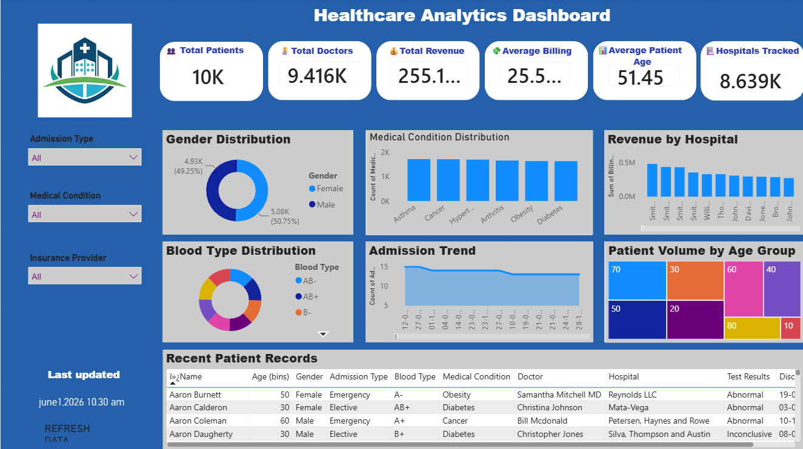

 🏥 Healthcare Analytics Dashboard

 📌 Project Overview

The **Healthcare Analytics Dashboard** is an interactive Business Intelligence solution developed using **Power BI** and **MySQL**. This project transforms raw healthcare data into meaningful insights through dynamic visualizations, KPI monitoring, and interactive reporting.

The dashboard enables healthcare professionals, administrators, and decision-makers to analyze patient demographics, medical conditions, hospital performance, billing trends, and admission patterns, helping support data-driven decisions.

---

 🎯 Project Objectives

- Analyze healthcare data efficiently using interactive dashboards.
- Monitor patient demographics and medical conditions.
- Track billing and admission trends.
- Provide meaningful insights for healthcare decision-making.
- Improve data visualization and reporting using Business Intelligence tools.

---

 🚀 Key Features

- 📊 Interactive KPI Cards
- 👥 Patient Demographics Analysis
- 🏥 Medical Condition Distribution
- 👨‍⚕️ Doctor-wise Patient Analysis
- 🩸 Blood Group Distribution
- 💰 Billing Analysis
- 📈 Admission Trend Analysis
- 🎛️ Interactive Slicers and Filters
- 📑 Professional Dashboard Design
- ⚡ Dynamic and User-Friendly Visualizations

---

 📊 Dashboard Preview

The dashboard provides an interactive overview of healthcare data through multiple visualizations including KPI cards, charts, and filters.

> **Dashboard Screenshot**

---

 📈 Business Questions Answered

This dashboard helps answer important healthcare business questions such as:

- How many patients are available in the dataset?
- Which medical conditions are most common?
- What is the gender distribution of patients?
- Which blood groups occur most frequently?
- How are patient admissions changing over time?
- Which doctors manage the highest number of patients?
- What are the overall billing trends?
- How can healthcare data improve operational decision-making?

---

 🛠️ Technologies Used

- Microsoft Power BI
- MySQL
- SQL
- Data Visualization
- Data Analysis
- Dashboard Design
- Business Intelligence (BI)

---

 📂 Project Files

| File | Description |
|------|-------------|
| Healthcare_Analytics_Dashboard.pbix | Power BI Project File |
| Healthcare_Analytics_Dashboard.pdf | Dashboard Export |
| Healthcare_Analytics_Dashboard.png | Dashboard Preview |
| dataset.csv | Healthcare Dataset |
| README.md | Project Documentation |

---

 📊 Dashboard Insights

The dashboard provides insights into:

- Total Patients
- Average Age
- Billing Analysis
- Medical Condition Distribution
- Blood Group Distribution
- Gender Analysis
- Doctor Performance
- Admission Trends
- Interactive Filtering

---

 💼 Skills Demonstrated

- Data Cleaning
- Data Transformation
- Data Modeling
- SQL Database Integration
- Power BI Dashboard Development
- KPI Design
- Business Intelligence Reporting
- Interactive Dashboard Development
- Analytical Thinking
- Data Storytelling

---

 🚀 Future Enhancements

- Real-Time Database Connectivity
- Predictive Healthcare Analytics
- Machine Learning Integration
- Patient Risk Prediction
- Automated Dashboard Refresh
- Mobile Dashboard Optimization

---

 📷 Project Screenshot

Add additional dashboard screenshots here if required.

---

📚 Learning Outcomes

Through this project, I gained practical experience in:

- Building professional Power BI dashboards
- Connecting Power BI with MySQL databases
- Designing KPI-driven reports
- Creating interactive business reports
- Presenting healthcare data through visual storytelling
- Publishing projects on GitHub

---

 👩‍💻 Author

**Joselin Rubba**

Aspiring Data Analyst | Power BI | SQL | MySQL | Data Visualization | Business Intelligence

GitHub:
https://github.com/joselinrubha1129-netizen

---

 ⭐ If you found this project useful

Please consider giving this repository a ⭐ on GitHub.
